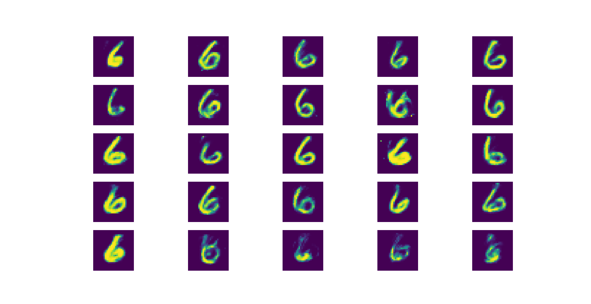
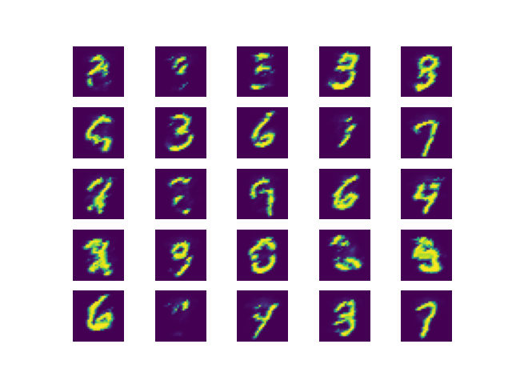
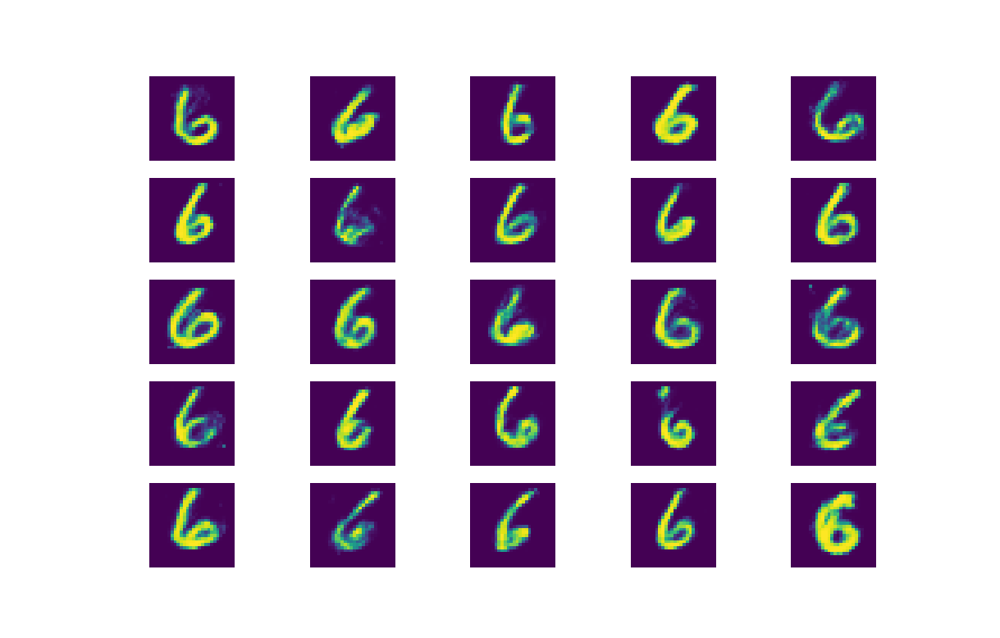
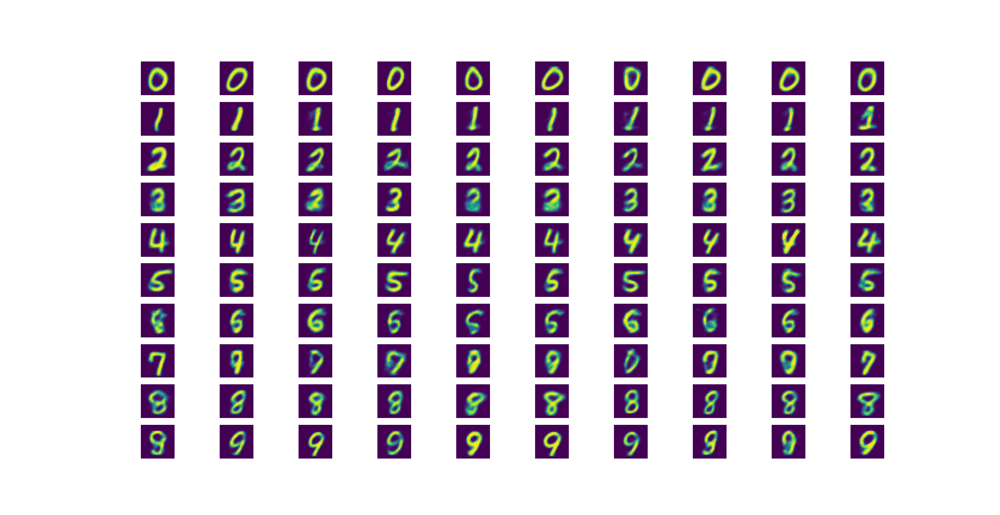
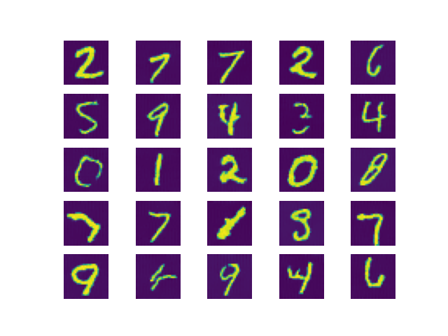
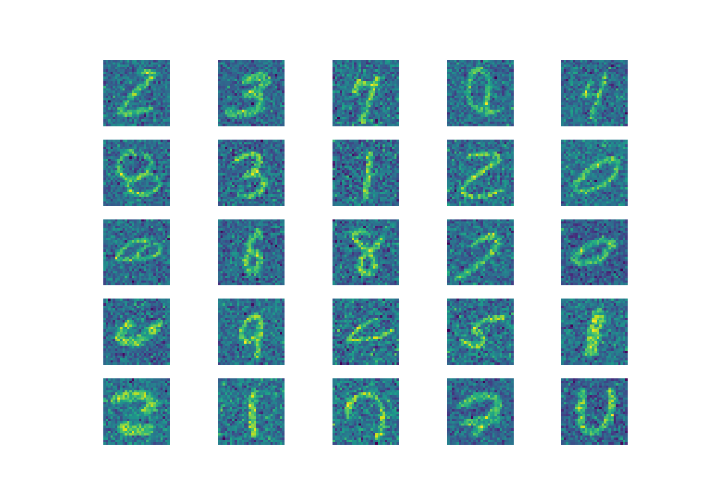
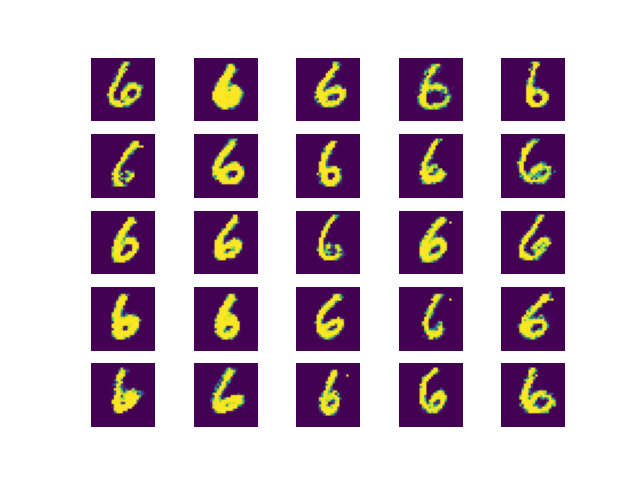
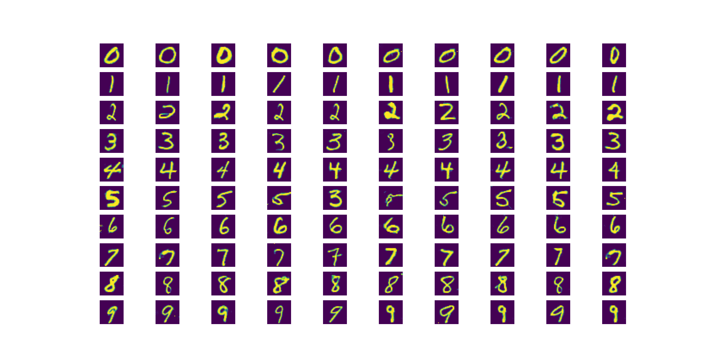

<!-- LOGO -->

  

<h3 align="center">Machine Learning</h3>

<!-- TABLE OF CONTENTS -->

  
Table of Contents

  <ol>
    <li>
      <a href="#neural-networks">Neural Networks</a>
      <ul>
        <li><a href="#transformer">Transformer</a></li>
      </ul>
    </li>
    <li>
      <a href="#generative-models">Generative Models</a>
      <ul>
        <li><a href="#flow">Flow</a></li>
        <li><a href="#autoregressive-models">Autoregressive Models</a></li>
        <li><a href="#variational-autoencoder">Variational Autoencoder</a></li>
        <li><a href="#diffusion-models">Diffusion Models</a></li>
        <li><a href="#score-matching">Score Matching</a></li>
        <li><a href="#generative-adversarial-networks">Generative Adversarial Networks</a></li>
      </ul>
    </li>
    <li><a href="#reinforcement-learning">Reinforcement Learning</a></li>
  </ol>

<!-- NEURAL NETWORKS -->
## Neural Networks
Several popular neural networks are implemented using Pytorch:
<li><a href="Code/ML_classification/MLP.py">Fully Connected Neural Network</a></li>
<li><a href="Code/ML_classification/CNN.py">Convolutional Neural Network  </a></li>
<li><a href="Code/ML_classification/RNN.py">Recurrent Neural Network  </a></li>
<li><a href="Code/ML_classification/ResNet.py">ResNet </a></li>
<li><a href="Code/ML_classification/UNet.py">U-Net </a></li>
<li><a href="Code/ML_classification/Self_attention.py">Self-attention</a></li>
<li><a href="Code/ML_classification/ViT.py">Video Transformer</a></li> 
The models are experimented on image classification tasks. For comparison, a <a href="Code/ML_classification/Bayes.py">naive Bayes model</a> is also implemented.

(<a href="#readme-top">back to top</a>)

### Transformer
Transformer architecture is based on the paper <a href="https://arxiv.org/abs/1706.03762">"Attention Is All You Need"</a>. The architecture is implemented for an English-Chinese translator. <a href="https://spacy.io/">spaCy</a> is used for word embedding. Both greedy and beam search are implemented for word selection. 
Files can be found <a href="/Code/Translator/">here</a> including the training dataset containing English and Chinese sentences.  
Results generated by beam search size 10 are quite impressive:
<table>
  <tr>
    <th>English</th>
    <th>Translated Chinese</th>
  </tr>
  <tr>
    <td>"As you can see, things are getting better."</td>
    <td>"你可以看到，情况会变好。"</td>
  </tr>
  <tr>
    <td>"And it’s not often that something comes along that’s worth the attention of all those billions."</td>
    <td>"而这一幕并不常发生，这是数十亿人值得关注的事情。"</td>
  </tr>
  <tr>
    <td>"How are you today?"</td>
    <td>"你今天如何呢？"</td>
  </tr>
  <tr>
    <td>"We're not going to bend."</td>
    <td>"我们不会倒退。"</td>
  </tr>
  <tr>
    <td>"Canada announces retaliatory tariffs on US goods."</td>
    <td>"加拿大宣布对美国商品征收报复性关税。"
</td>
  </tr>
</table> 

(<a href="#readme-top">back to top</a>)

<!-- GENERATIVE MODELS -->
## Generative Models
### Flow
Flow-based generative models estimate probability distributions by transforming a simple base distribution (like standard Gaussian) into a complex data distribution using an invertible map. Because the transformation is invertible, exact log-likelihood computation is directly tractable.  

 Real NVP (Real-valued Non-Volume Preserving) is a seminal flow architecture that achieves efficient computation using coupling layers. In each layer, a portion of the data dimensions is left unchanged, while the remaining dimensions are updated using affine transformations (scaling and translation) whose parameters are output by arbitrary neural networks. This design keeps the Jacobian matrix triangular, making the determinant trivial to compute while allowing exact likelihood evaluation.  

Details are in <a href="/Notes/Flow/Flow.pdf">study notes</a>. 

A Real-NVP model is implemented <a href="/Code/Flow/Flow.py">here</a>.  

Referencing paper: <a href="https://arxiv.org/abs/1605.08803">"Density estimation using Real NVP"</a> 

Samples generated (MNIST dataset digit 6):

    

(<a href="#readme-top">back to top</a>)

### Autoregressive Models
Autoregressive models generate complex data by decomposing the joint probability distribution into a chain of conditional probabilities using the probabilistic chain rule. Under this framework, the probability of generating each sequence element depends strictly on the preceding elements that were already produced. While this autoregressive process ensures stable training and explicitly models sequence dependencies, it also makes sampling inherently sequential and slower during inference compared to parallelized generative approaches like Normalizing Flows. 

Details are in <a href="/Notes/Autoregressive/Autoregressive.pdf">study notes</a>.  

A NADE model is implemented <a href="/Code/Autoregressive/Autoregressive.py">here</a>.  

Referencing paper: <a href="https://arxiv.org/abs/1605.02226">"Neural Autoregressive Distribution Estimation"</a> 

Samples generated (MNIST dataset):

    

(<a href="#readme-top">back to top</a>)

### Variational Autoencoder
Variational Autoencoders (VAEs) are probabilistic generative models that learn complex data distributions by mapping input into a latent space. The encoder compresses input data into the parameters of a tractable distribution (typically a Gaussian), while the decoder reconstructs the original data from latent samples drawn from that space. VAEs are trained using the Evidence Lower Bound (ELBO) objective, which balances reconstruction error with a regularization term, the Kullback-Leibler divergence, that forces the latent representation to align with a simple prior distribution. VAE uses reparameterization trick to allow backpropagation through stochastic sampling nodes.  

Details are in <a href="/Notes/VAE/VAE.pdf">study notes</a>. 

Both <a href="/Code/VAE/VAE.py">unconditional</a> and <a href="/Code/VAE/VAE_conditional.py">conditional</a> models are implemented.  

Referencing paper: <a href="https://arxiv.org/abs/1312.6114">"Auto-Encoding Variational Bayes"</a> 

Samples generated from unconditional model (MNIST dataset digit 6):

    

Samples generated from conditional model (MNIST dataset conditioned on each label):

    

(<a href="#readme-top">back to top</a>)

### Diffusion Models
Diffusion models are generative models that learn to generate data by reversing a gradual noise-addition process. During the forward diffusion process, Gaussian noise is incrementally added to the input data over a sequence of steps until it transforms completely into Gaussian noise. The model is then trained to estimate and remove this added noise at each step during the reverse process, reconstructing clean data samples from pure random noise.  

Details are in <a href="/Notes/Diffusion/Diffusion.pdf">study notes</a>. 

The model is implemented <a href="/Code/Diffusion/Diffusion.py">here</a>.  

Referencing paper: <a href="https://arxiv.org/abs/2006.11239">"Denoising Diffusion Probabilistic Models"</a> 

Samples generated (MNIST dataset):

    

(<a href="#readme-top">back to top</a>)

### Score Matching
Score-based generative models estimate the vector field of the data distribution's log-probability density, known as the score function, rather than calculating the distribution's density directly. By training a neural network via score matching to predict the direction of steepest growth in probability density, these models learn how to push unorganized data toward high-probability regions of the real data. During generation, iterative sampling techniques like Langevin dynamics step along these estimated gradient fields to turn random noise into realistic data samples. This framework avoids normalizing constants and forms the theoretical backbone linking continuous-time diffusion processes with gradient-based generative modeling. 

Details are in <a href="/Notes/Score Matching/Score Matching.pdf">study notes</a>. The model is implemented <a href="/Code/Score_Matching/score_matching.py">here</a>.  

Referencing papers: <a href="https://jmlr.org/papers/v6/hyvarinen05a.html">"Estimation of Non-Normalized Statistical Models by Score Matching"</a> 
<a href="https://arxiv.org/abs/2011.13456">"Score-Based Generative Modeling through Stochastic Differential Equations"</a> 

Samples generated (MNIST dataset):

    

(<a href="#readme-top">back to top</a>)

### Generative Adversarial Networks
Generative Adversarial Networks (GANs) generate data through a game-theoretic minimax framework between two competing neural networks: a Generator and a Discriminator. The generator creates synthetic samples from random noise, trying to make them indistinguishable from real data, while the discriminator evaluates samples to correctly distinguish real training data from the generator's fakes. Through this continuous adversarial loop, both networks iteratively improve: the discriminator gets better at catching subtle flaws, and the generator learns to synthesize increasingly plausible outputs.  

Details are in <a href="/Notes/GAN/GAN.pdf">study notes</a>. (This set of notes may be very mathematical. Some background information is <a href="/Notes/Background/Background.pdf">here</a>.) 

Both <a href="/Code/GAN/GAN.py">unconditional</a> and <a href="/Code/GAN/GAN_conditional.py">conditional</a> models are implemented.  

Referencing paper: <a href="https://arxiv.org/abs/1406.2661">"Generative Adversarial Networks"</a> 

Samples generated from unconditional model (MNIST dataset digit 6):

    

This is quite impressive considering only fully connected networks are used.

Samples generated from conditional model (MNIST dataset conditioned on each label):

    

(<a href="#readme-top">back to top</a>)

<!-- REINFORCEMENT LEARNING -->

## Reinforcement Learning
Reinforcement Learning (RL) enables an agent to learn optimal decision-making strategies through trial-and-error interactions with an environment, aiming to maximize cumulative long-term rewards. Algorithms within RL generally fall into three core approaches based on how this decision process is modeled. 

Q-learning, a value-based method, estimates the expected total reward of taking specific actions in given states to determine the best choice indirectly. 

In contrast, policy-based learning directly optimizes the agent's strategy, the policy network, by adjusting action probabilities using performance gradients without relying on explicit state-value estimates. 

The actor-critic method combines both strengths: an "actor" updates the policy based on directional guidance from a "critic," which simultaneously evaluates the action's value to reduce training variance and accelerate convergence.  

The set of <a href="/Notes/Reinforcement Learning/Reinforcement Learning.pdf">study notes</a> contains value-based learning (Q-learning), policy-based learning and actor-critic method (with baseline). 

(<a href="#readme-top">back to top</a>)

